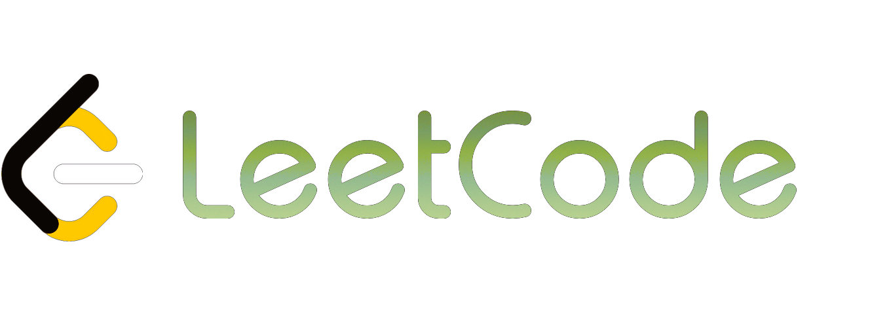

<!---->

# Hi there! 

## 🚀 About Me

🎓 I am Lav Yadav, a **Full Stack Web Developer** (specializing in **MERN Stacks**). I am also Pursuing my Bachelor in **Computer Science & Engineering** and will 
    graduate in mid-2024.

 👨‍💻 I have proficiency in building MERN stack applications, handling both front-end and back-end tasks, and have a good understanding of data structure and algorithms, solved over 750 problems on LeetCode, ranking in the top 5% of coders and maintaining a rating of approximately 1893 on Leetcode.

📝 I enjoy coding, building websites, and solving real-world problems. I am really enthusiastic about learning new technology and learning new skills.

🎸 Apart from tech stuff, I like trying new things and learning new skills. Cricket is my favorite hobby. I love playing it and watching games. When I want to 
   relax, I enjoy watching movies and web series.

🤝 Feel free to contact me at yadavlav571@gmail.com

 
## 🌐 Connect with me :

## 🧮 Coding Profile Link :

## 💻 Tech Skills :
 
 

 

 

 
 

## 📊 GitHub Stats:
 

<!-- github stats -->

<!-- most used languages -->

### 🔝 Top Contributed Repo

### ✍️ Random Dev Quote

<!-- Proudly created with GPRM ( https://gprm.itsvg.in ) -->

